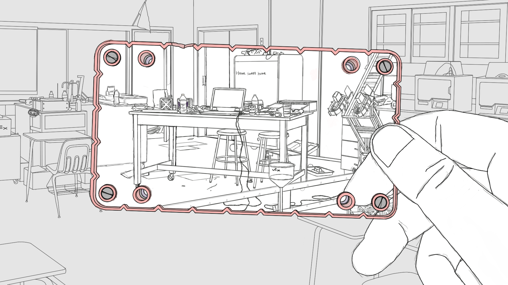
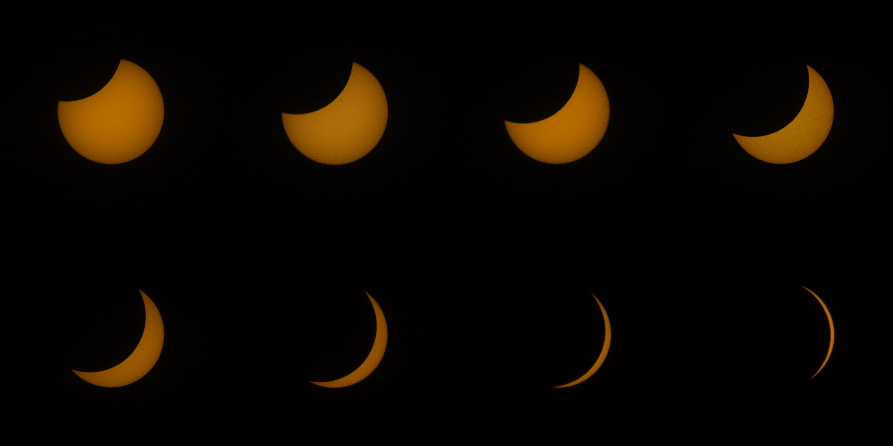
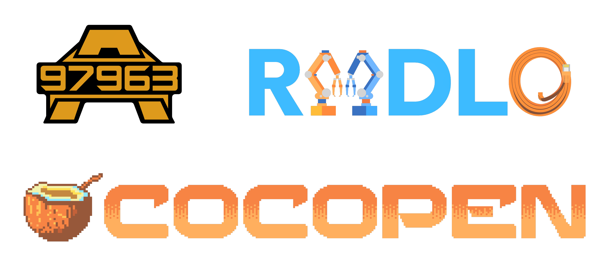

[Drawing](#drawing), [Photography](#photography), [Graphic Design](#graphic-design)
&nbsp;

<h4 id="drawing"><strong>Drawing</strong></h4>
---

WIP drawing from winter 2021, portraying my high school's "Mostly Robotics Lab" before and after my graduation. Home sweet home.

 
&nbsp;

Stuff I drew when I took breaks from research.

&nbsp; 

<h4 id="photography"><strong>Photography</strong></h4>
---

Star trail photo from winter 2016, my first winter in the United States. It was taken in the backyard of a local family in Maryland that I stayed with :D

 
&nbsp;

The four seasons in Champaign, from August 2020 to July 2021.

 
&nbsp;

Photography class assignments feat. streets near my apartment.

 
&nbsp; 

Eclipse photos taken in Champaign, Illinois.

 
&nbsp;

<h4 id="graphic-design"><strong>Graphic Design</strong></h4>
---

Logos I designed for various teams and projects.

 