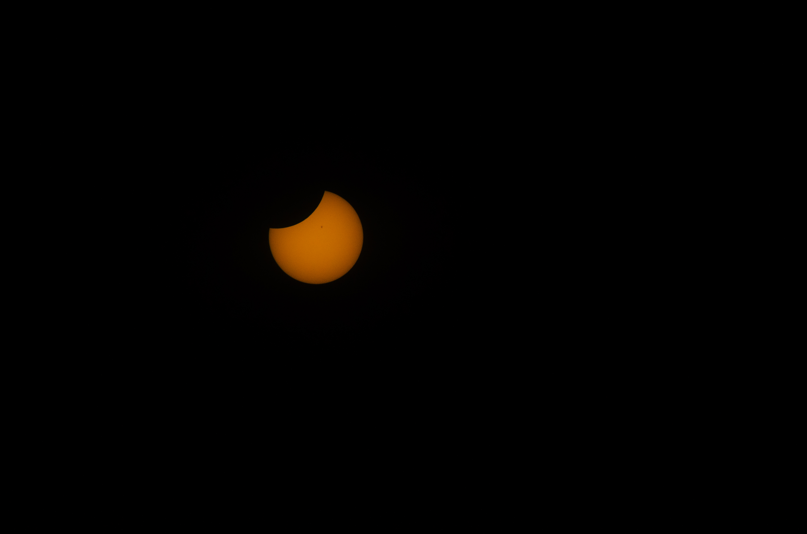
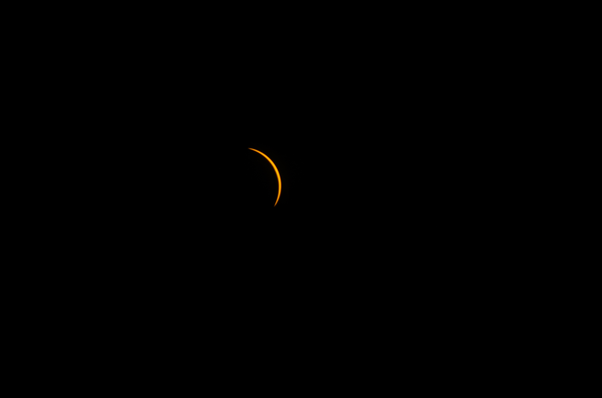
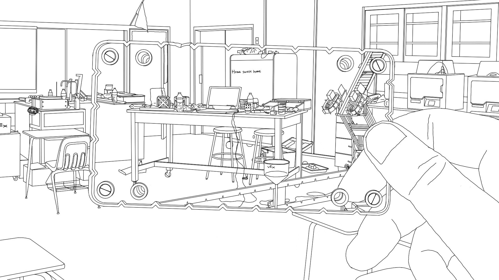

[Photography](#photography), [Drawing](#drawing), [Graphic Design](#graphic-design)
&nbsp;

<h4 id="photography"><strong>Photography</strong></h4>
---

I took a photo of this alley behind my apartment building because it looked interesting.

 
&nbsp;

I took a photo of this street because it looked interesting too.

 
&nbsp;

Eclipse photos taken in Champaign, Illinois.

 

 
&nbsp;

<h4 id="drawing"><strong>Drawing</strong></h4>
---

"Home sweet home." This is an old drawing for the thousands of hours I spent in The John Carroll School room 204, "Mostly Robotics Lab". Maybe I will finish this drawing someday.

 
&nbsp;

Here is a quick sketch I did while taking a break from research during one of those cold 4am mornings.

&nbsp; 

<h4 id="graphic-design"><strong>Graphic Design</strong></h4>
---

Here are the logos I designed for various teams and projects.

 