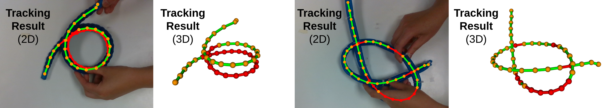
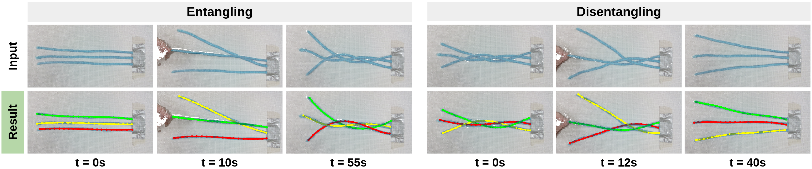

<h3 id="current-research"><strong>Current Research</strong></h3>
---

This section will be updated whenever I publish my first paper.

&nbsp;

<h3 id="undergrad-research"><strong>Undergraduate Research</strong></h3>
---

<h4 id="single-dlo-shape-tracking"><strong>Deformable Linear Object Shape Tracking Under Occlusion</strong></h4>

Deformable linear object tracking estimates the current state of the object from a sequence of segmented RGB-D images and is crucial to closed-loop manipulation tasks. Known failure cases of deformable linear object tracking include occlusion from other objects and itself. We introduce TrackDLO, a real-time, occlusion-robust deformable linear object tracking algorithm. The TrackDLO algorithm improves on previous approaches by addressing three common scenarios which cause their failure: tip occlusion, mid-section occlusion, and self-occlusion. This is achieved through a combination of: the use of a pre-processing step to preserve the total length of the deformable linear object; the application of Motion Coherence Theory to impute the spatial displacement field of the occluded portion of the object; and the use of the geodesic distance metric to better handle self-occlusion. 

 

&nbsp;

<h4 id="multi-dlo-shape-tracking"><strong>Simultaneous Shape Tracking of Multiple Deformable Linear Objects</strong></h4>

The goal of multi-object tracking is to identify objects of interest in each frame of a video sequence and associate them across frames to track their movements. Multi-object tracking for deformable linear objects is difficult because objects can entangle with each other, posing great challenges for instance segmentation. Our work introduces an algorithm for tracking the shape of multiple entangling deformable linear objects from an RGB-D video sequence. Instance segmentation (expensive) is only required for the first frame and all subsequent frames run on semantic segmentation (cheap). This is achieved through the use of Global-Local Topology Preservation with geodesic instead of Euclidean distance, which better represents the distance between separate objects and the distance between different parts of the same object. 

&nbsp;

<h4 id="deliverables"><strong>All Deliverables</strong></h4>
---
##### **Code**
* [TrackDLO](https://github.com/RMDLO/trackdlo) (ROS Package)
* [TrackDLO+](https://github.com/jingyi-xiang/trackdlo_plus) (ROS Package)
* [multi-dlo](https://github.com/RMDLO/multi-dlo) (ROS Package)
* [BCPD for DLO tracking](https://github.com/jingyi-xiang/bcpd-dlo-tracking) (ROS Package)

##### **Papers and Reports**
* [TrackDLO: Tracking Deformable Linear Objects Under Occlusion with Motion Coherence](https://ieeexplore.ieee.org/document/10214157) (RA-L Paper)
* [Simultaneous Shape Tracking of Multiple Deformable Linear Objects with Global-Local Topology Preservation](https://jingyi-xiang.github.io/assets/pdf/multidlo.pdf) (ICRA Workshop Extended Abstract)
* [Tracking Deformable Linear Objects in RGB-D Imagery with Geodesic-Based Bayesian Coherent Point Drift](https://jingyi-xiang.github.io/assets/pdf/CS_498_Project_Report.pdf) (Machine Perception Class Project Report)

##### **Presentations**
* [Simultaneous Shape Tracking of Multiple Deformable Linear Objects with Global-Local Topology Preservation](https://jingyi-xiang.github.io/assets/pdf/multi_dlo_poster.pdf) (Poster)
* [TrackDLO: Tracking Deformable Linear Objects Under Occlusion with Motion Coherence](https://jingyi-xiang.github.io/assets/pdf/poster_urs23.pdf) (Poster)
* [Wire Instance Perception from RGBD Imagery with Mask R-CNN](https://jingyi-xiang.github.io/assets/pdf/poster_urs22.pdf) (Poster)

&nbsp;