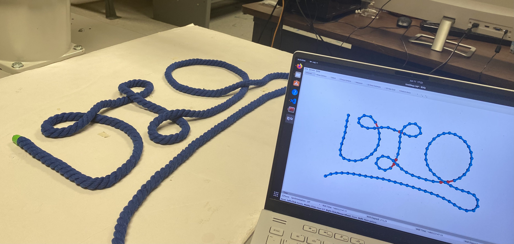
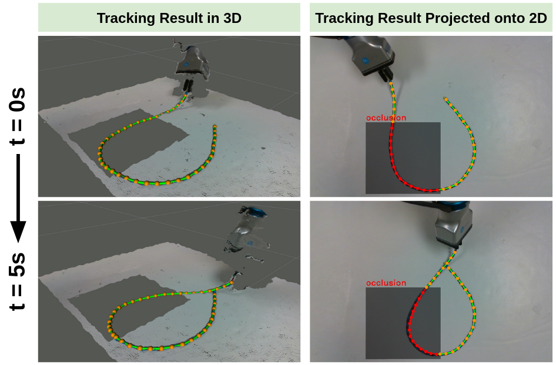
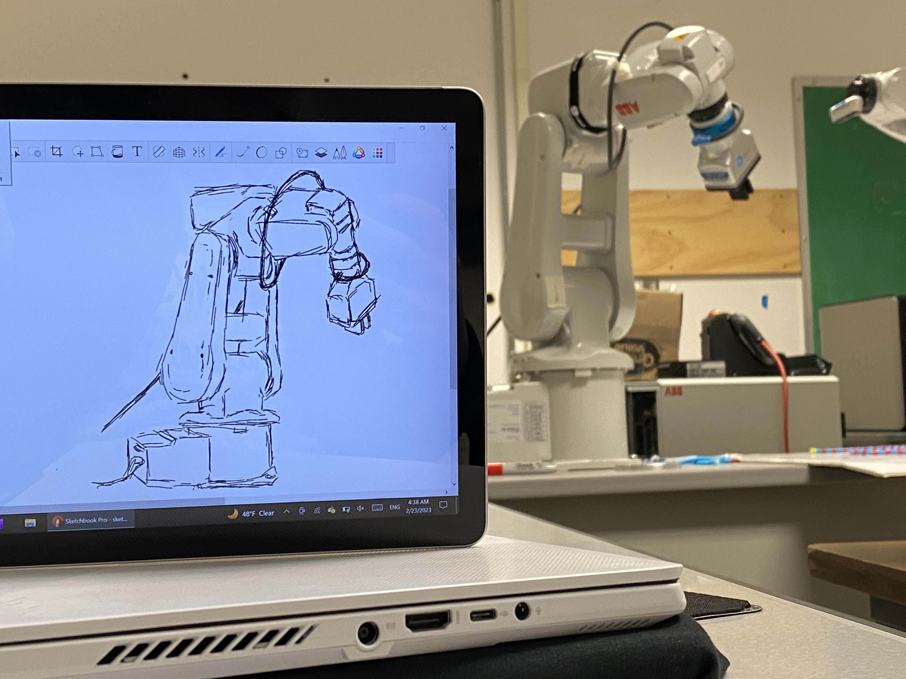

[Fall 2023 - Spring 2024 (Senior Thesis)](#Fall-2023-Spring-2024) \\
[Fall 2022 - Spring 2023 (Independent Study)](#Fall-2022-Spring-2023) \\
[Spring 2023 (Class Project)](#Spring-2023) \\
[Summer 2022 (ISGC Undergraduate Research Opportunity Program)](#Summer-2022) \\
[Spring 2022 (Undergraduate Research Apprenticeship Program)](#Spring-2022)

<!-- [All Deliverables](#deliverables) -->

&nbsp;

<!-- ##### **Senior Thesis (Fall 2023 - Spring 2024)** -->
<h4 id="Fall-2023-Spring-2024"><strong>Senior Thesis (Fall 2023 - Spring 2024)</strong></h4>
---
* In progress :)

&nbsp;

<!-- ##### **ECE Independent Study with the Bretl Research Group (Fall 2022 - Spring 2023)** -->
<h4 id="Fall-2022-Spring-2023"><strong>ECE Independent Study with the Bretl Research Group (Fall 2022 - Spring 2023)</strong></h4>
---
* Developed a new deformable linear object tracking algorithm, [TrackDLO](https://youtu.be/MxqNJsen5eg), for robust deformable linear object tracking under occlusion. The algorithm is vision-only and does not require external state information from physics modeling, simulation, visual markers, or contact as input.
* Developed the open-source [TrackDLO ROS (Robot Operating System) package](https://github.com/RMDLO/trackdlo) with the TrackDLO algorithm implemented in C++.
* Completed a [paper](https://ieeexplore.ieee.org/document/10214157) on the TrackDLO algorithm which was accepted into the IEEE Robotics and Automation Letters (RA-L).
* Collaborated with other researchers in the group to create [COCOpen](https://rmdlo.github.io/COCOpen-OpenCV/), an open-source library that automatically generates datasets of color images with objects of interest, labeled with object instance segmentation masks, bounding boxes, and category identification.
* Delivered two hour-long research presentations to the Bretl Research Group on the topic of deformable object perception and tracking (Presentation slides: [Fall 2022](https://jingyi-xiang.github.io/assets/pdf/BRG_Fall_2022.pdf), [Spring 2023](https://jingyi-xiang.github.io/assets/pdf/BRG_Spring_2023.pdf)).
* Completed an [extended abstract](https://jingyi-xiang.github.io/assets/pdf/multidlo.pdf) on simultaneous multi-DLO tracking and presented a [poster](https://jingyi-xiang.github.io/assets/pdf/multi_dlo_poster.pdf) at the IEEE International Conference on Robotics and Automation (ICRA) Workshop on Representing and Manipulating Deformable Objects.
* Presented a [poster](https://jingyi-xiang.github.io/assets/pdf/poster_urs23.pdf) on the TrackDLO algorithm at the 2023 UIUC Undergraduate Research Symposium.

##### <u>Images
<!-- 

     

 -->
<!-- 

     

 -->
(1). We ran our TrackDLO algorithm on a rope posed to resemble the word "DLO" (**D**eformable **L**inear **O**bject):
 

(2). Our [multi-dlo package](https://github.com/RMDLO/multi-dlo) successfully tracks three identical blue ropes twisted together:

(3). Our poster presented at the ICRA 2023 Workshop on Representing and Manipulating Deformable Objects:
<a href="https://jingyi-xiang.github.io/assets/pdf/multi_dlo_poster.pdf">

(4). My poster presented at the 2023 UIUC Undergraduate Research Symposium:
<a href="https://jingyi-xiang.github.io/assets/pdf/poster_urs23.pdf">

&nbsp;

<!-- ##### **CS 498 Machine Perception Class Project (Spring 2023)** -->
<h4 id="Spring-2023"><strong>CS 498 Machine Perception Class Project (Spring 2023)</strong></h4>
---
* Implemented a recently published non-rigid registration algorithm, [Geodesic-Based Bayesian Coherent Point Drift](https://ieeexplore.ieee.org/abstract/document/9918058), in both Python and C++.
* Integrated the Geodesic-Based Bayesian Coherent Point Drift algorithm into TrackDLO, the deformable linear object tracking algorithm that was being developed by me during the time, to improve the tracking performance in edge cases.
* [Final Report](https://jingyi-xiang.github.io/assets/pdf/CS_498_Project_Report.pdf) and [code](https://github.com/jingyi-xiang/bcpd-dlo-tracking).

##### <u>Images
<!-- 

     

 -->
(1). A demonstration of deformable linear object shape tracking under occlusion:
 

&nbsp;

<!-- ##### **Illinois Space Grant Consortium's Undergraduate Research Opportunity Program (Summer 2022)** -->
<h4 id="Summer-2022"><strong>Illinois Space Grant Consortium's Undergraduate Research Opportunity Program (Summer 2022)</strong></h4>
---
* Selected to participate in a paid 10-week summer research program with the Bretl Research Group.
* Designed and 3D printed custom camera mounts for linking the camera and the robot end-effector.
* Calibrated our hardware system with fiducial markers and two eye-in-hand camera calibration algorithms: the [Tsai-Lenz method](https://web.archive.org/web/20140211090216id_/http://www-old.me.gatech.edu:80/me6406/handeye.pdf) and a [pose graph optimization based method](https://ieeexplore.ieee.org/abstract/document/8616862).
* Basing off of point set registration algorithm [Global-Local Topology Preservation](https://www.cv-foundation.org/openaccess/content_cvpr_workshops_2014/W04/papers/Ge_Non-rigid_Point_Set_2014_CVPR_paper.pdf), developed a new method for tracking multiple deformable linear objects simultaneously without continuous instance segmentation.
* Delivered a 15-minute presentation at the program symposium.

##### <u>Images

     

From left to right, top to bottom:
1. The point cloud of an ethernet cable produced by stitching together several point clouds taken from different perspectives.
2. I implemented Gaussian Mixture Model (GMM) clustering and [Coherent Point Drift](https://proceedings.neurips.cc/paper/2006/file/3b2d8f129ae2f408f2153cd9ce663043-Paper.pdf) (CPD) from scratch and compared their performance for point set registration under occlusion.

&nbsp;

<!-- ##### **Undergraduate Research Apprenticeship Program (Spring 2022)** -->
<h4 id="Spring-2022"><strong>Undergraduate Research Apprenticeship Program (Spring 2022)</strong></h4>
---
* Selected as one of the 60 participants from a pool of more than 500 applicants to work with a graduate student mentor on research projects.
* Implemented the [Copy-Paste Augmentation method](https://openaccess.thecvf.com/content/CVPR2021/papers/Ghiasi_Simple_Copy-Paste_Is_a_Strong_Data_Augmentation_Method_for_Instance_CVPR_2021_paper.pdf) in an automated dataset generation process to scale the amount of available training data and to eliminate the time-consuming process of manual image annotation.
* Identified, implemented, and evaluated two state-of-the-art deformable linear object instance segmentation algorithms ([Ariadne](https://link.springer.com/chapter/10.1007/978-3-030-20890-5_42) and [Ariadne+](https://ieeexplore.ieee.org/abstract/document/9721686)).
* Used the instance segmentation masks output from Mask R-CNN to segment featureless point clouds in stereo depth imagery.
* Presented our deformable linear object instance segementation results with an [extended abstract](https://jingyi-xiang.github.io/assets/pdf/wire_segmentation.pdf) at the IEEE International Conference on Robotics and Automation (ICRA) Workshop on Representing and Manipulating Deformable Objects.
* Presented a [poster](https://jingyi-xiang.github.io/assets/pdf/poster_urs22.pdf) at the 2022 UIUC Undergraduate Research Symposium.

##### <u>Images

     

From left to right, top to bottom:
1. The RGB cable instance segmentation result and the corresponding segmented point cloud produced by a trained Mask R-CNN model.
2. My [poster](https://jingyi-xiang.github.io/assets/pdf/poster_urs22.pdf) presented at the 2022 UIUC Undergraduate Research Symposium.

&nbsp;

<!-- <h4 id="deliverables"><strong>A Collection of All Deliverables</strong></h4>
---
##### **Code**
* [TrackDLO](https://github.com/RMDLO/trackdlo) (ROS Package)
* [multi-dlo](https://github.com/RMDLO/multi-dlo) (ROS Package)
* [BCPD for DLO tracking](https://github.com/jingyi-xiang/bcpd-dlo-tracking) (ROS Package)
* [COCOpen](https://rmdlo.github.io/COCOpen-OpenCV/) (Python Library)

##### **Papers and Reports**
* [TrackDLO: Tracking Deformable Linear Objects Under Occlusion with Motion Coherence](https://ieeexplore.ieee.org/document/10214157) (RA-L Paper)
* [Simultaneous Shape Tracking of Multiple Deformable Linear Objects with Global-Local Topology Preservation](https://jingyi-xiang.github.io/assets/pdf/multidlo.pdf) (ICRA Workshop Paper)
* [Tracking Deformable Linear Objects in RGB-D Imagery with Geodesic-Based Bayesian Coherent Point Drift](https://jingyi-xiang.github.io/assets/pdf/CS_498_Project_Report.pdf) (Class Project Report)
* [Wire Point Cloud Instance Segmentation from RGBD Imagery with Mask R-CNN](https://jingyi-xiang.github.io/assets/pdf/wire_segmentation.pdf) (ICRA Workshop Paper)

##### **Presentations**
* [Deformable Linear Object Tracking as Non-Rigid Point Set Registration](https://jingyi-xiang.github.io/assets/pdf/BRG_Spring_2023.pdf) (Slides)
* [Tracking Deformable Linear Objects Under Occlusion](https://jingyi-xiang.github.io/assets/pdf/BRG_Fall_2022.pdf) (Slides)
* [Simultaneous Shape Tracking of Multiple Deformable Linear Objects with Global-Local Topology Preservation](https://jingyi-xiang.github.io/assets/pdf/multi_dlo_poster.pdf) (Poster)
* [TrackDLO: Tracking Deformable Linear Objects Under Occlusion with Motion Coherence](https://jingyi-xiang.github.io/assets/pdf/poster_urs23.pdf) (Poster)
* [Wire Instance Perception from RGBD Imagery with Mask R-CNN](https://jingyi-xiang.github.io/assets/pdf/poster_urs22.pdf) (Poster)

&nbsp; -->

<!-- ##### **Bonus** -->
<h4 id="Bonus"><strong>Bonus</strong></h4>
---
Here is a quick sketch I did while taking a break from research.

     
    <!--  -->

