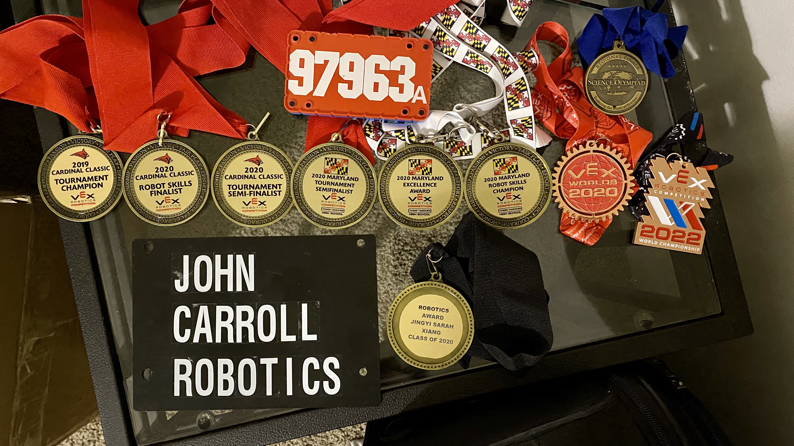
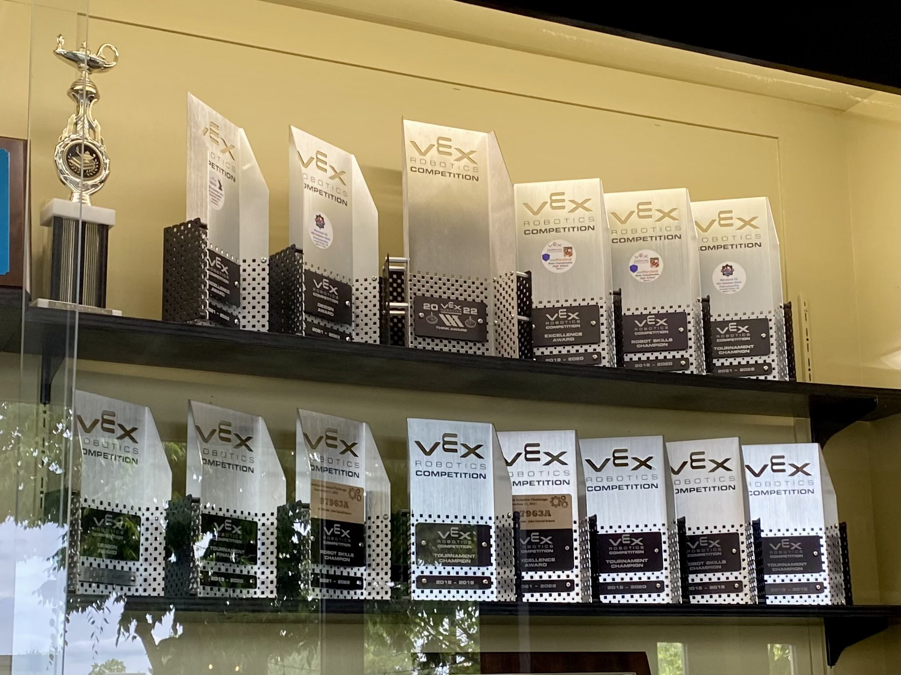

I competed in the [VEX Robotics Competition](https://www.vexrobotics.com/competition) from 2018 - 2021, an extracurricular activity that eventually sparked my interest in robotics. My team's stats can be found [here](https://vexdb.io/teams/view/97963A?t=skills). 

[2019 - 2020 (Tower Takeover)](#2019-2020) \\
[2020 - 2021 (Change Up)](#2020-2021)

###### Depending on the internet, the CAD models might take a minute to fully load.
&nbsp;

<h4 id="2019-2020"><strong>2019 - 2020 (Tower Takeover)</strong></h4>
---
**Game Objective:** [Picking up and stacking plastic cubes](https://youtu.be/_JVQOiw_OUU?si=q_86EvSG9_fqZzCo) \\
**Robot Videos:** [Playlist](https://www.youtube.com/watch?v=2yH0XbTgVOY&list=PLOVSIsYOyOF3BGpvA9BS9q3m-NSgKIeYY&index=1) \\
**Global Ranking:** 18th (combined); 3rd (programming)

**Robot CAD Model:**
<iframe src="https://myhub.autodesk360.com/ue2f80a7d/shares/public/SHd38bfQT1fb47330c99ec0e6178b2116ec2?mode=embed" width="640" height="480" allowfullscreen="true" webkitallowfullscreen="true" mozallowfullscreen="true"  frameborder="0"></iframe>

&nbsp;

<h4 id="2020-2021"><strong>2020 - 2021 (Change Up)</strong></h4>
---
**Game Objective:** [Picking up plastic spheres and dropping them into cylindrical baskets](https://www.youtube.com/watch?v=Hxs0q9UoMDQ) \\
**Robot Videos:** [Iteration 1 Playlist](https://www.youtube.com/watch?v=lbfCjw0BKeE&list=PLOVSIsYOyOF0WgNdBguiLier7NUoR-k7x&index=1), [Iteration 2 Playlist](https://www.youtube.com/watch?v=Oa5fJqwaVGs&list=PLOVSIsYOyOF2BbGYWc2-0hXRldbet2tI_&index=1) \\
**Global Ranking:** 5th (combined)

**Iteration 1 Robot CAD Model:**
<iframe src="https://myhub.autodesk360.com/ue2f80a7d/shares/public/SHd38bfQT1fb47330c99615bb1780f279fbb?mode=embed" width="640" height="480" allowfullscreen="true" webkitallowfullscreen="true" mozallowfullscreen="true"  frameborder="0"></iframe>

\\
**Iteration 2 Robot CAD Model:**
<iframe src="https://myhub.autodesk360.com/ue2f80a7d/shares/public/SHd38bfQT1fb47330c99994e9579cec1fabc?mode=embed" width="640" height="480" allowfullscreen="true" webkitallowfullscreen="true" mozallowfullscreen="true"  frameborder="0"></iframe>

&nbsp;

##### **Other Things**

---
[Robot code](https://github.com/jingyi-xiang/non_holonomic_control) from past seasons; [Guides](https://github.com/jingyi-xiang/vrc_resources) written by me

- - -
 

 